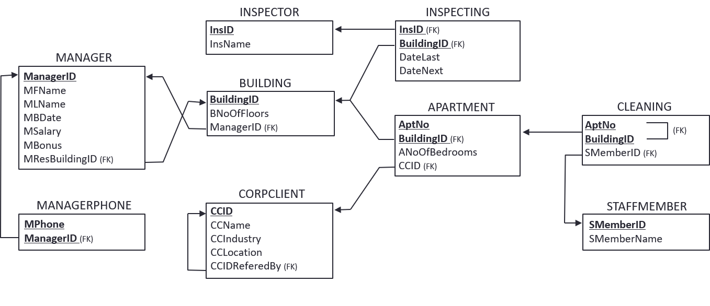

```{r setup, include=FALSE}
library("readr")
library("dplyr")
library("tidyr")
```

# Task
Given the following relational data schema of the ISDL Property Management LC (see Figure 1). The foreign keys are indicated with (FK) in the schema. 
As a junior data scientist, you have been asked to apply your new knowledge of the R Library dplyr and complete the following tasks. 

```{r echo = FALSE, fig.cap= "Figure 1:  relational data schema of the ISDL property management LC"}

```

## Import data
In the following, we import the data from the GitHub directory (https://github.com/VAWi-DataScience/2021/tree/main/Lecture/03_Data%20Wrangling/data)

```{r initdata, message=FALSE, warning=FALSE, include=FALSE}

inspector <- read_csv(file.path(params$datadir, "inspector.csv"), 
                      col_names = c("InsID","InsName"))

inspecting <- read_csv2(file.path(params$datadir, "inspecting.csv"),
                        col_names = c("InsID","BuildingID","DateLast","DateNext"),
                        #Set columns to date type
                        col_types = cols(DateLast = col_date(format="%d.%m.%Y"), 
                                         DateNext = col_date(format="%d.%m.%Y")))

manager <- read_csv(file.path(params$datadir, "manager.csv"), 
                    col_names = c("ManagerID","MFName","MLName","MBDate","MSalary", "MBonus","MResBuildingID"),
                    #Set columns to date type
                    col_types = cols(MBDate = col_date(format="%Y-%m-%d")))

managerphone <- read_csv(file.path(params$datadir, "managerphone.csv"), 
                         col_names = c("ManagerID","MPhone"))

building <- read_csv2(file.path(params$datadir, "building.csv"), 
                      col_names = c("BuildingID","BNoOfFloors", "ManagerID"))

corpclient <- read_csv(file.path(params$datadir, "corpclient.csv"), 
                       col_names = c("CCID","CCName", "CCIndustry","CCLocation","CCIDReferedBy"))

apartment <- read_csv(file.path(params$datadir, "apartment.csv"), col_names = c("BuildingID","AptNo", "ANoOfBedrooms","CCID"))

cleaning <- read_csv(file.path(params$datadir, "cleaning.csv"), 
                     col_names = c("BuildingID","AptNo", "SMemberID"))


staffmember <- read_csv(file.path(params$datadir, "staffmember.csv"), 
                        col_names = c("SMemberID","SMemberName"))
```
## Inspect the data

```{r viewdata, echo=FALSE}
print("Inspector")
glimpse(inspector)
print("Inspecting")
glimpse(inspecting)
print("Manager")
glimpse(manager)
print("Building")
glimpse(building)
print("Apartment")
glimpse(apartment)
print("Cleaning")
glimpse(cleaning)
print("Managerphone")
glimpse(managerphone)
print("Corpclient")
glimpse(corpclient)
print("Staffmember")
glimpse(staffmember)
```

# Query 1
Show the name of all staff members in ascending order.

```{r query-1}
query1 <- staffmember %>%
  select(SMemberName) %>%
  arrange(SMemberName) # Sort by name

query1

```

# Query 2
Show the ID and the name of all corporate clients located in Rosemont or Oak Park.

```{r query-2}
query_2 <- corpclient %>%
  filter(CCLocation == "Rosemont" | CCLocation == "Oak Park") %>%  
  select(CCID, CCName) 

#Alternative with %in% 
location <- c("Rosemont","Oak Park")
query_2 <- corpclient %>%
  filter(CCLocation %in%location) %>% 
  select(CCID, CCName) 

query_2
```

# Query 3
Show the `BuildingID` the number of floors of the building and the lastname of the responsible manager. 

```{r query-3}
query_3 <- building %>%
  left_join(manager, by="ManagerID") %>%
  select(BuildingID, BNoOfFloors, MLName)

query_3
```

# Query 4
Show all manager (`MFName` and `MFFname`), who have a salary (`MSalary`) less than 55.000 and manage at least two buildings.

```{r query-4, message=FALSE}
query_4 <- building %>%
  group_by(ManagerID) %>%
  summarise(NumberOfBuildings = n()) %>% #Because there are only groups of one we get a notification in the console. We can turnout these messages in the settings of the code-junk
  left_join(manager, by="ManagerID") %>%
  filter( MSalary < 55000) %>% #Filter based on `MSalary`
  filter(NumberOfBuildings >= 2) %>%
  select(MFName, MLName, MSalary)

query_4

```

# Query 5
Show the ID of the inspector (`InsID`) and the name (`InsName`) for all inspectors having a inspection in 2021. Show the same results only once. 

```{r query-5}
query_5 <- inspecting %>%
  filter(DateNext > as.Date("2021-01-01")) %>% #Column should be in date format. Either when importing or here by casting the type
  inner_join(inspector, by="InsID") %>%
  select(InsID, InsName) %>%
  distinct()

query_5
```

# Query 6
Show the id of the (`SMemberID`) and the name (`SMemberName`) staff members who clean apartments for corporate clients located in Chicago. 

```{r query-6}
query_6 <- corpclient %>%
  filter(CCLocation == "Chicago") %>%
  inner_join(apartment, by = "CCID") %>%
  inner_join(cleaning, by = c("AptNo", "BuildingID")) %>% #Join data with double foreign key
  inner_join(staffmember, by = "SMemberID") %>%
  select(SMemberID, SMemberName) %>%
  distinct()
query_6
```

# Query 7
Show all the corporate client id (`CCID`),name(`CCName`)and the name of the corporate client that referred the respective corporate client. 

```{r query-7}
query_7 <- corpclient %>%

  inner_join(corpclient, c( "CCIDReferedBy" = "CCID"), suffix=c("","_ReferredBy")) %>% #Self join with a suffix for the new columns
  select(CCID,CCName, ReferredByCCName=CCName_ReferredBy)

```
